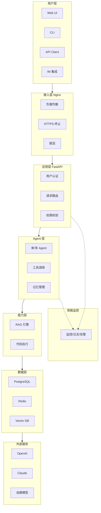

# 项目 10：端到端 Agent 应用（毕业设计）

> **阶段**：Phase 4 - 综合实战
> **周次**：Week 13-14
> **难度**：⭐⭐⭐⭐⭐⭐
> **预估工时**：30-40 小时

---

## 一、项目目标

从 0 到 1 设计一个生产级 Agent 应用，自由选题，但必须满足完整的工程化要求。

**核心能力培养**：
- 独立设计能力
- 完整工程化能力
- 架构设计能力
- 答辩与表达能力

---

## 二、选题建议

### 2.1 选题方向

#### 方向 A：业务自动化类

| 选题 | 核心功能 | 技术亮点 |
|------|----------|----------|
| 智能客服 Agent | 自动回答客户问题、升级人工 | RAG + 多轮对话 |
| 销售线索 Agent | 自动筛选、跟进客户 | 工具调用 + CRM 集成 |
| 财务报销 Agent | 自动审核发票、生成报表 | OCR + 规则引擎 |
| HR 简历筛选 Agent | 自动评估简历、推荐候选人 | 文档解析 + 评分模型 |

#### 方向 B：开发者工具类

| 选题 | 核心功能 | 技术亮点 |
|------|----------|----------|
| Code Review Agent | 自动审查 PR、提出建议 | Git API + 代码分析 |
| 自动化测试 Agent | 自动生成测试用例、执行 | 代码执行 + 单元测试 |
| 文档生成 Agent | 自动从代码生成文档 | 代码理解 + 文档模板 |
| Bug 诊断 Agent | 自动分析日志、定位问题 | 日志分析 + 知识库 |

#### 方向 C：知识管理类

| 选题 | 核心功能 | 技术亮点 |
|------|----------|----------|
| 个人知识库 Agent | 对接 Notion/Obsidian，智能问答 | RAG + 知识图谱 |
| 研究助理 Agent | 自动搜集资料、生成报告 | Web 搜索 + 多 Agent |
| 会议纪要 Agent | 自动转录、生成纪要、提取待办 | 语音识别 + 摘要 |
| 学习助手 Agent | 制定学习计划、出题、批改 | 个性化推荐 + 评估 |

#### 方向 D：创意生成类

| 选题 | 核心功能 | 技术亮点 |
|------|----------|----------|
| 营销文案 Agent | 自动生成多平台文案 | 多模态 + A/B 测试 |
| 视频脚本 Agent | 自动生成短视频脚本 | 创意生成 + 模板 |
| 设计 Agent | 根据需求生成 UI/UX | 多模态 + 设计系统 |

---

### 2.2 选题建议

**推荐选题（综合能力展示）**：
- **智能客服 Agent**（最实用，需求明确）
- **Code Review Agent**（技术含量高）
- **个人知识库 Agent**（展示 RAG 能力）
- **研究助理 Agent**（展示多 Agent 协作）

**避免选题**：
- 纯 Demo 项目（没有实际场景）
- 范围太大（不可能 2 周完成）
- 缺乏数据（无法评估效果）

---

## 三、技术要求详解

### 3.1 必须满足的要求

#### ✅ 容器化部署

**要求**：
- Dockerfile（多阶段构建）
- Docker Compose（多服务编排）
- 镜像大小 < 1GB
- 镜像推送到 Docker Hub 或云镜像仓库

**评分要点**：
- [ ] 镜像构建成功
- [ ] docker compose up 一键启动
- [ ] 数据持久化
- [ ] 健康检查

#### ✅ 监控系统

**要求**：
- LLM 调用追踪（Token、延迟、成本）
- 系统指标监控（CPU、内存、请求量）
- 错误日志
- 至少一个可视化 Dashboard

**评分要点**：
- [ ] 每次 LLM 调用都有日志
- [ ] Dashboard 能看到核心指标
- [ ] 有错误告警机制

#### ✅ 权限控制

**要求**：
- 用户认证（至少 JWT）
- API 鉴权
- 资源访问控制

**评分要点**：
- [ ] 未认证请求被拒绝
- [ ] 权限不足被拒绝
- [ ] 敏感操作有二次确认

#### ✅ 成本优化

**要求**：
- 至少一种成本优化策略（缓存/多模型路由/Prompt 优化）
- 成本监控 Dashboard
- 成本预警

**评分要点**：
- [ ] 能看到成本数据
- [ ] 有明确的优化策略
- [ ] 优化前后对比数据

#### ✅ 安全防御

**要求**：
- Prompt 注入检测
- 敏感信息过滤
- 内容审核
- 至少 10 个安全测试用例

**评分要点**：
- [ ] 基础攻击被阻止
- [ ] 安全测试报告完整
- [ ] 关键操作有审计日志

#### ✅ 文档完整

**要求**：
- README.md（项目介绍、快速开始）
- 架构文档
- API 文档（OpenAPI/Swagger）
- 部署文档
- 演示视频

---

### 3.2 量化验收标准

> 以下指标为毕业答辩评分的硬性量化门槛。

| 验收维度 | 及格线（60分） | 良好线（75分） | 优秀线（90分+） |
|----------|-------------|-------------|---------------|
| 安全测试通过率 | ≥ 80% | ≥ 90% | = 100% |
| API P95 延迟 | < 10s | < 5s | < 3s |
| 镜像大小 | < 1GB | < 800MB | < 500MB |
| 安全测试用例数 | ≥ 10 | ≥ 20 | ≥ 30 |
| 成本优化降幅 | ≥ 10% | ≥ 25% | ≥ 40% |
| Dashboard 可用指标 | ≥ 5 个 | ≥ 10 个 | ≥ 15 个 |
| 压力测试 QPS | ≥ 5 | ≥ 10 | ≥ 20 |
| 错误率（24h） | < 5% | < 2% | < 1% |
| 文档完整度 | README + 架构图 | + API 文档 | + 部署文档 + 演示视频 |

---

### 3.3 加分项

- [ ] 自动化测试覆盖率 > 70%
- [ ] CI/CD 流程完整
- [ ] 有公开 Demo 链接
- [ ] 有技术博客
- [ ] 开源到 GitHub 并有 Star
- [ ] 答辩展示优秀
- [ ] 解决了一个真实业务问题（不是假想场景）

---

## 四、项目实施流程

### 4.1 Week 13 任务分解

#### Day 1-2：需求分析与设计

**任务**：
- [ ] 明确目标用户和使用场景
- [ ] 列出核心功能和非核心功能
- [ ] 画系统架构图
- [ ] 技术选型（模型、框架、数据库）
- [ ] 编写需求文档

**产出**：
- 需求文档（Markdown）
- 架构图（Draw.io / Excalidraw）
- 技术选型 rationale

#### Day 3-4：核心功能开发

**任务**：
- [ ] 实现核心 Agent 逻辑
- [ ] 集成必要的工具/API
- [ ] 基础 UI（命令行或 Web）
- [ ] 单元测试

**产出**：
- 可运行的原型
- 单元测试覆盖核心逻辑

#### Day 5-7：工程化完善

**任务**：
- [ ] Docker 化
- [ ] 监控系统
- [ ] 权限控制
- [ ] 安全防御
- [ ] 文档撰写

**产出**：
- 完整可部署的系统
- 完整文档

### 4.2 Week 14 任务分解

#### Day 1-2：测试与优化

**任务**：
- [ ] 集成测试
- [ ] 性能测试
- [ ] 安全测试
- [ ] Bug 修复
- [ ] 性能优化

#### Day 3-4：部署与演示

**任务**：
- [ ] 部署到云服务器
- [ ] 配置 CI/CD
- [ ] 录制演示视频
- [ ] 撰写技术博客

#### Day 5：答辩准备

**任务**：
- [ ] 准备答辩 PPT
- [ ] 演练答辩
- [ ] 准备 Q&A

#### Day 6-7：答辩

**任务**：
- 30 分钟展示 + Q&A

---

## 五、架构设计模板

### 5.1 标准架构

**架构图（Mermaid）**：



**ASCII 版架构图**：

```
┌─────────────────────────────────────────┐
│           用户层                         │
│   Web UI / CLI / API / IM 集成         │
└─────────────────────────────────────────┘
                 ↓
┌─────────────────────────────────────────┐
│          接入层（Nginx）                 │
│   - 负载均衡                            │
│   - HTTPS 终止                          │
│   - 限流                                │
└─────────────────────────────────────────┘
                 ↓
┌─────────────────────────────────────────┐
│         应用层（FastAPI）                │
│   - 用户认证                            │
│   - 请求路由                            │
│   - 权限校验                            │
└─────────────────────────────────────────┘
                 ↓
┌─────────────────────────────────────────┐
│         Agent 层                         │
│   - 单/多 Agent                         │
│   - 工具调用                            │
│   - 记忆管理                            │
└─────────────────────────────────────────┘
                 ↓
┌─────────────────────────────────────────┐
│         能力层                           │
│   ┌──────────┐  ┌──────────┐            │
│   │ RAG 引擎 │  │ 代码执行 │  ...       │
│   └──────────┘  └──────────┘            │
└─────────────────────────────────────────┘
                 ↓
┌─────────────────────────────────────────┐
│         数据层                           │
│   PostgreSQL / Redis / Vector DB       │
└─────────────────────────────────────────┘
                 ↓
┌─────────────────────────────────────────┐
│         外部服务                         │
│   OpenAI / Claude / 自建模型            │
└─────────────────────────────────────────┘

旁路：监控 / 日志 / 告警
```

---

## 六、完整项目示例

### 6.1 项目结构

```
intelligent-customer-service/
├── app/
│   ├── __init__.py
│   ├── main.py                 # FastAPI 入口
│   ├── config.py               # 配置管理
│   ├── api/                    # API 路由
│   │   ├── auth.py
│   │   ├── chat.py
│   │   └── admin.py
│   ├── core/                   # 核心逻辑
│   │   ├── agent.py            # Agent 实现
│   │   ├── tools.py            # 工具定义
│   │   ├── memory.py           # 记忆管理
│   │   └── security.py         # 安全防御
│   ├── models/                 # 数据模型
│   │   ├── user.py
│   │   ├── conversation.py
│   │   └── knowledge.py
│   ├── services/               # 业务服务
│   │   ├── llm_service.py
│   │   ├── rag_service.py
│   │   └── knowledge_service.py
│   ├── utils/                  # 工具函数
│   │   ├── monitoring.py
│   │   ├── logger.py
│   │   └── cost_tracker.py
│   └── web/                    # 前端
│       ├── index.html
│       └── app.js
├── tests/                      # 测试
│   ├── unit/
│   ├── integration/
│   └── security/
├── docs/                       # 文档
│   ├── architecture.md
│   ├── api.md
│   └── deployment.md
├── scripts/                    # 脚本
│   ├── init_db.py
│   └── seed_data.py
├── monitoring/                 # 监控配置
│   ├── prometheus.yml
│   └── grafana-dashboard.json
├── nginx/                      # Nginx 配置
│   └── nginx.conf
├── .github/
│   └── workflows/
│       └── ci.yml
├── Dockerfile
├── docker-compose.yml
├── requirements.txt
├── .env.example
├── .dockerignore
├── .gitignore
├── README.md
├── CHANGELOG.md
└── LICENSE
```

---

### 6.2 核心代码示例

**main.py**：
```python
from fastapi import FastAPI, Depends
from fastapi.middleware.cors import CORSMiddleware
from contextlib import asynccontextmanager
import logging

from app.config import settings
from app.api import auth, chat, admin
from app.core.security import SecurityMiddleware
from app.utils.monitoring import setup_monitoring

logging.basicConfig(level=logging.INFO)
logger = logging.getLogger(__name__)

@asynccontextmanager
async def lifespan(app: FastAPI):
    # 启动
    logger.info("🚀 应用启动中...")
    await setup_monitoring()
    yield
    # 关闭
    logger.info("👋 应用关闭")

app = FastAPI(
    title="智能客服 Agent API",
    version="1.0.0",
    lifespan=lifespan
)

# CORS
app.add_middleware(
    CORSMiddleware,
    allow_origins=settings.CORS_ORIGINS,
    allow_credentials=True,
    allow_methods=["*"],
    allow_headers=["*"],
)

# 安全中间件
app.add_middleware(SecurityMiddleware)

# 路由
app.include_router(auth.router, prefix="/api/auth", tags=["auth"])
app.include_router(chat.router, prefix="/api/chat", tags=["chat"])
app.include_router(admin.router, prefix="/api/admin", tags=["admin"])

@app.get("/health")
async def health():
    return {"status": "healthy"}

if __name__ == "__main__":
    import uvicorn
    uvicorn.run(app, host="0.0.0.0", port=8000)
```

**agent.py**：
```python
from langchain.chat_models import ChatOpenAI
from langchain.agents import AgentExecutor, create_openai_functions_agent
from langchain.tools import Tool
from langchain.prompts import ChatPromptTemplate, MessagesPlaceholder
from langchain.memory import ConversationSummaryBufferMemory

class CustomerServiceAgent:
    """智能客服 Agent"""

    def __init__(self):
        self.llm = ChatOpenAI(
            model="gpt-4o-mini",
            temperature=0.3
        )

        self.tools = self._setup_tools()
        self.memory = self._setup_memory()
        self.agent_executor = self._setup_agent()

    def _setup_tools(self) -> list:
        """配置工具"""
        return [
            Tool(
                name="search_knowledge_base",
                func=self.search_kb,
                description="搜索知识库，回答产品相关问题"
            ),
            Tool(
                name="check_order_status",
                func=self.check_order,
                description="查询订单状态"
            ),
            Tool(
                name="create_ticket",
                func=self.create_ticket,
                description="创建工单（需要人工处理时）"
            ),
            Tool(
                name="escalate_to_human",
                func=self.escalate,
                description="转接人工客服"
            )
        ]

    def _setup_memory(self) -> ConversationSummaryBufferMemory:
        """配置记忆"""
        return ConversationSummaryBufferMemory(
            llm=self.llm,
            max_token_limit=2000,
            memory_key="chat_history",
            return_messages=True
        )

    def _setup_agent(self) -> AgentExecutor:
        """配置 Agent"""
        prompt = ChatPromptTemplate.from_messages([
            ("system", """你是专业的客服助手。

规则：
1. 优先使用工具查询真实数据
2. 不知道就说不知道
3. 涉及金钱、退款、投诉等问题，转人工
4. 保持友好、专业的语气"""),
            MessagesPlaceholder(variable_name="chat_history"),
            ("human", "{input}"),
            MessagesPlaceholder(variable_name="agent_scratchpad")
        ])

        agent = create_openai_functions_agent(
            llm=self.llm,
            tools=self.tools,
            prompt=prompt
        )

        return AgentExecutor(
            agent=agent,
            tools=self.tools,
            memory=self.memory,
            verbose=True,
            max_iterations=5,
            handle_parsing_errors=True
        )

    async def chat(self, user_id: str, message: str) -> dict:
        """处理用户消息"""
        # 1. 安全检查
        if not self.security_check(message):
            return {
                "response": "抱歉，您的请求包含不安全内容，无法处理。",
                "blocked": True
            }

        # 2. 调用 Agent
        result = await self.agent_executor.ainvoke({
            "input": message
        })

        # 3. 后处理
        return {
            "response": result["output"],
            "blocked": False,
            "user_id": user_id
        }
```

---

## 七、答辩要求

### 7.1 答辩流程（30 分钟）

#### 1. 项目介绍（5 分钟）

- 选题背景：要解决什么问题？
- 目标用户：谁会用？
- 核心功能：3-5 个关键功能

#### 2. 架构设计（5 分钟）

- 整体架构图
- 关键技术决策（rationale）
- 与其他方案的对比

#### 3. 演示（10 分钟）

- 现场演示（5-7 个场景）
- 展示监控 Dashboard
- 展示安全测试结果

#### 4. 技术亮点（5 分钟）

- 解决了哪些技术难题？
- 有哪些创新点？
- 性能/成本数据

#### 5. Q&A（5 分钟）

- 回答评审问题

### 7.2 答辩 PPT 模板

```
1. 封面
   - 标题
   - 团队成员
   - 日期

2. 项目背景
   - 问题描述
   - 市场调研
   - 目标用户

3. 需求分析
   - 功能需求
   - 非功能需求
   - 验收标准

4. 架构设计
   - 系统架构图
   - 技术栈选型
   - 数据流图

5. 核心实现
   - 关键技术 1
   - 关键技术 2
   - 关键代码片段

6. 演示
   - 场景 1 截图
   - 场景 2 截图
   - 监控 Dashboard

7. 测试结果
   - 功能测试
   - 性能测试
   - 安全测试

8. 项目总结
   - 完成情况
   - 遇到的问题
   - 未来规划

9. Q&A
```

---

## 八、评分标准

### 8.1 评分维度

| 维度 | 权重 | 评估要点 |
|------|------|----------|
| 功能完整性 | 30% | 核心功能是否完整、可用 |
| 工程化水平 | 25% | 部署、监控、CI/CD 是否完善 |
| 代码质量 | 15% | 架构设计、代码规范、可维护性 |
| 安全性 | 10% | 认证授权、注入防御、敏感信息保护 |
| 性能与成本 | 10% | 响应时间、Token 消耗、缓存策略 |
| 文档与演示 | 10% | README、API 文档、演示视频 |

### 8.2 等级标准

| 等级 | 分数 | 说明 |
|------|------|------|
| 优秀 | 85+ | 可直接用于生产 |
| 良好 | 70-84 | 接近生产水平 |
| 及格 | 60-69 | 具备基本工程化能力 |
| 不及格 | <60 | 需要返工 |

### 8.3 答辩评分

| 维度 | 权重 | 评估要点 |
|------|------|----------|
| 内容完整度 | 30% | 是否覆盖所有要求 |
| 表达清晰度 | 30% | 讲得是否清楚 |
| 技术深度 | 20% | 是否有深入思考 |
| 现场应变 | 20% | Q&A 表现 |

---

## 九、交付物清单

### 9.1 必交材料

- [ ] **完整代码**（GitHub Repo）
  - 所有源代码
  - 配置文件
  - 部署脚本
  - 测试代码
  - .gitignore / .dockerignore
  - LICENSE

- [ ] **架构设计文档**
  - 系统架构图
  - 数据流图
  - 技术选型 rationale
  - 关键决策记录

- [ ] **API 文档**
  - OpenAPI/Swagger 文档
  - 接口示例
  - 错误码说明

- [ ] **部署文档**
  - 环境要求
  - 部署步骤
  - 配置说明
  - 故障排查

- [ ] **演示视频**（5-10 分钟）
  - 功能演示
  - 监控 Dashboard
  - 安全测试

- [ ] **技术博客**（3000 字以上）
  - 项目背景
  - 技术方案
  - 踩坑经验
  - 性能数据

- [ ] **答辩 PPT**
  - 内容完整
  - 美观专业
  - 重点突出

### 9.2 加分材料

- [ ] 公开 Demo 链接
- [ ] CI/CD 配置
- [ ] 测试覆盖率报告
- [ ] 性能压测报告
- [ ] 用户使用反馈

---

## 十、参考项目

### 10.1 开源参考

- **LangChain Templates**：https://github.com/langchain-ai/langchain/tree/master/templates
- **AutoGen Examples**：https://github.com/microsoft/autogen/tree/main/samples
- **FastAPI Best Practices**：https://github.com/zhanymkanov/fastapi-best-practices

### 10.2 优秀案例

| 项目 | 说明 |
|------|------|
| GPT Researcher | 自动化研究报告生成 |
| Open Interpreter | 代码执行 Agent |
| ChatDev | 模拟软件开发公司 |
| MetaGPT | 多 Agent 协作框架 |

---

**🎉 恭喜！完成这个项目后，你就具备了独立设计和开发生产级 Agent 系统的能力。**

**接下来**：
- 在工作中应用所学
- 持续学习新论文、新框架
- 参与开源社区
- 考虑细分方向深入（金融、医疗、教育等）
